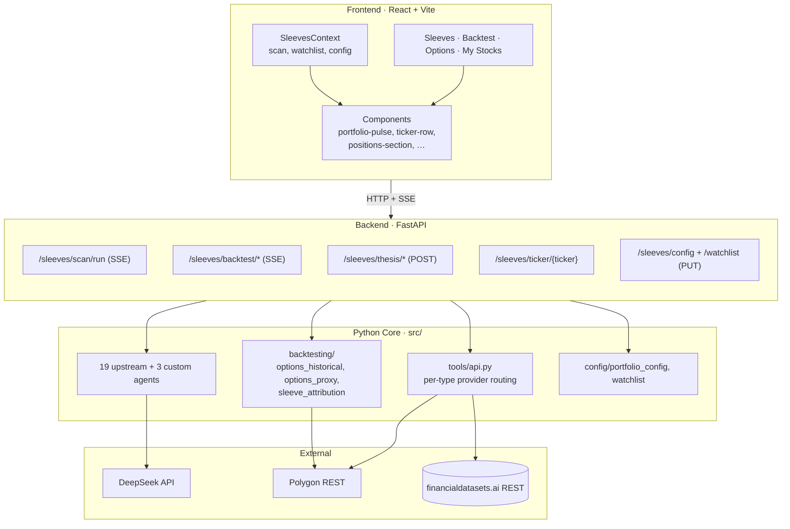
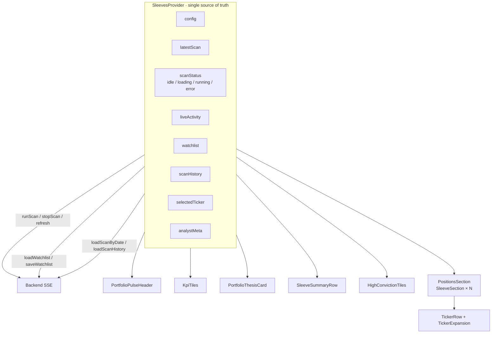
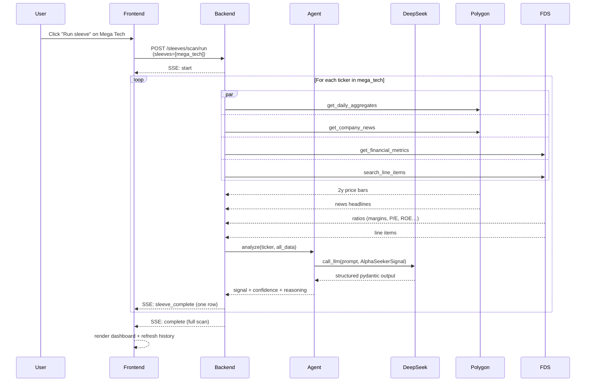

# Architecture

This is the contributor-facing deep dive. For the project overview, screenshots, and quick-start, see [README.md](README.md).

Three layers, each with one clear responsibility:

1. **Python core** ([`src/`](src/)) — agents, data adapters, backtesting, config.
2. **FastAPI backend** ([`app/backend/`](app/backend/)) — REST + SSE endpoints, LLM synthesis services, file-rewrite services for atomic config updates.
3. **React + Vite frontend** ([`app/frontend/`](app/frontend/)) — single-page app, dark-theme-first, no chart library (inline SVG only).



---

## Conventions enforced in this repo

These aren't preferences — the existing code follows them. New code that violates these creates drift; PRs should match.

1. **Type hints on every public Python function.** `from __future__ import annotations` at the top of every module so `|` syntax works on 3.12.
2. **Docstrings on every public function and module.** Modules explain the *why*; functions cover non-obvious behavior.
3. **No silently swallowed exceptions.** Either re-raise, log with `logger.warning` / `logger.exception`, or convert to a domain error (see `MassiveError`).
4. **Retries are explicit, not hidden.** Exponential backoff with jitter for external APIs. Pattern in [`tools/massive/client.py`](src/tools/massive/client.py).
5. **Validate at import time.** Config files (e.g. `portfolio_config.py`) call their validators at module load so a bad edit fails loudly instead of two hours into a scan.
6. **Tests pin behavior, not implementation.** Schema construction tests catch typos in `Literal` enum values. Aggregation tests use hand-crafted fixtures rather than mocks. See [`tests/test_morning_scan.py`](tests/test_morning_scan.py).
7. **Frontend: no new chart library.** Inline SVG only — see [`mini-spark.tsx`](app/frontend/src/components/sleeves/mini-spark.tsx) and [`price-sparkline.tsx`](app/frontend/src/components/sleeves/price-sparkline.tsx) for the established pattern.

---

## Agent framework

Three custom agents live next to 19 upstream investor-persona agents.

### Output schema (Pydantic, strict)

Every agent returns a pydantic model with at minimum:

```python
class Signal(BaseModel):
    signal: Literal["bullish", "bearish", "neutral"]
    confidence: float = Field(..., ge=0, le=100)
    reasoning: str  # may be structured for some agents
```

Custom agents extend this with sector-specific fields:

```python
class AlphaSeekerSignal(Signal):
    variant_perception: str
    has_edge: bool
    catalyst_near_term: str
    catalyst_medium_term: str
    catalyst_type: Literal["binary", "continuous", "n_a"]
    position_type: PositionType
    pair_with: str | None
    conviction: Conviction
    hold_period: HoldPeriod
    kill_switch: str
    probability_wrong: Literal["low", "medium", "high"]
```

### Adding a new agent

```bash
# 1. Create src/agents/your_agent.py with:
#    - Output schema (pydantic)
#    - your_agent_agent(state, agent_id) entry point
#    - Use call_llm() for structured output (handles retries + JSON parsing)

# 2. Register in src/utils/analysts.py — add to ANALYST_CONFIG with a unique order number.

# 3. Add a schema-construction test in tests/test_custom_agents.py.

# 4. To include in a sleeve, edit src/config/portfolio_config.py.
#    tests/test_portfolio_config.py catches typos via the registry cross-check.

# 5. Run tests:
poetry run pytest tests/test_custom_agents.py tests/test_portfolio_config.py
```

### Prompt iteration loop

The custom-agent prompts are tuned for a specific balance:

- **`alpha_seeker`** — STRONG EDGE vs DIRECTIONAL LEAN two-tier framing. "No edge — skip" is reserved for genuinely flat data (target <30% of tickers). Confidence anchors: 70-90 for strong + corroborating, 30-50 for thin.
- **`energy_transition`** — Allowed to use industry knowledge for FEOC inference when news flow is silent. "unknown" reserved for genuinely ambiguous names.
- **`emerging_tech`** — Explicit 5-band confidence anchors tied to scorecard agreement count.

To tune a prompt, edit the system prompt string in the agent file and run:

```bash
poetry run python -m src.run_morning_scan --tickers NVDA,MSFT --sleeve mega_tech
```

Then check `outputs/YYYY-MM-DD_morning_scan.json` for the structured output.

---

## Backend endpoints

Every `/sleeves/*` endpoint streams via SSE for long-running operations or returns JSON for snapshot queries.

| Endpoint | Method | Behavior |
|---|---|---|
| `/sleeves/config` | GET / PUT | Read or atomically replace the portfolio config |
| `/sleeves/config/sleeve/{name}` | POST / PUT / DELETE | Single-sleeve mutations |
| `/sleeves/watchlist` | GET / PUT | Opportunistic queue, persisted to `src/config/watchlist.py` |
| `/sleeves/scans` | GET | List historical scan files |
| `/sleeves/scans/latest` | GET | Most recent parsed scan |
| `/sleeves/scans/{date}` | GET | Scan from a specific date |
| `/sleeves/scan/run` | POST (SSE) | Live scan; events: `start`, `progress`, `sleeve_complete`, `complete`, `error` |
| `/sleeves/ticker/{ticker}` | GET | 2y price history + fundamentals + recent news + Polygon details |
| `/sleeves/thesis/portfolio` | POST | LLM PM-memo synthesis (cached) |
| `/sleeves/thesis/sleeve/{name}` | POST | Sleeve-scoped LLM thesis (cached) |
| `/sleeves/analysts` | GET | Analyst metadata for tooltips |
| `/sleeves/options/strategies` | GET | Strategy registry (11 strategies) |
| `/sleeves/options/screener` | GET | Per-strategy screener output for a sleeve |
| `/sleeves/options/chain/{ticker}` | GET | Live options chain snapshot |
| `/sleeves/backtest/options-strategy` | POST (SSE) | Options backtest, real-fill or BSM |
| `/sleeves/backtest/run` | POST (SSE) | Sleeves backtest with LLM agent panel |

### SSE event shape

```json
event: start
data: {"data": {"tickers": ["NVDA"], "sleeve": "mega_tech", "...": "..."}}

event: progress
data: {"agent": "alpha_seeker", "ticker": "NVDA", "status": "Fetching prices"}

event: sleeve_complete
data: {"sleeve": "mega_tech", "date": "2026-05-28", "rows": [{"...": "..."}]}

event: complete
data: {"data": {"date": "...", "row_count": 7, "rows": [...]}}

event: error
data: {"message": "Provider exhausted retries"}
```

The frontend's `postSse` helper in [`sleeves-api.ts`](app/frontend/src/services/sleeves-api.ts) consumes the stream and dispatches to per-event handlers.

---

## Backend services

### `thesis_service.py`

LLM-powered synthesis for portfolio and sleeve scopes. Key design:

- **Cache keyed by `(scope, scan_date, content_signature)`** — re-fetching the same thesis is free; a new scan invalidates automatically because the signature changes.
- **Default factories** for graceful LLM failure — return a deterministic placeholder rather than crashing the endpoint.
- **PM-voice prompt** — first-person plural, declarative, no hedge words. Each scope (portfolio / sleeve) has its own system prompt for the right granularity.

### `sleeve_config_service.py`

Atomic file rewrite of [`src/config/portfolio_config.py`](src/config/portfolio_config.py). Critical detail: the route handler in [`routes/sleeves.py`](app/backend/routes/sleeves.py) no longer does `from src.config.portfolio_config import PORTFOLIO_SLEEVES` (which would lock an old reference after `importlib.reload`). All lookups go through `_live_sleeves()` which reads the module attribute fresh on every call.

The service preserves the header docstring + helper functions, splicing only the `PORTFOLIO_SLEEVES` dict literal using brace-matching.

### `watchlist_service.py`

Same atomic-rewrite + `importlib.reload` pattern as `sleeve_config_service`, scoped to [`src/config/watchlist.py`](src/config/watchlist.py).

### `backtest_service.py`

The upstream LangGraph-based backtest engine, wrapped for SSE streaming.

---

## Frontend state model



Each tab (Sleeves / Backtest / Options / My Stocks) wraps in its own `SleevesProvider` so the context is scoped per-tab. Mounting two providers is fine — both fetch independently and the backend 5-min cache absorbs duplicates.

### Component map

```
app/frontend/src/components/sleeves/
├─ sleeves-tab.tsx                  ← Sleeves dashboard top-level
├─ portfolio-pulse-header.tsx       ← sticky header (Run portfolio, history)
├─ kpi-tiles.tsx                    ← 4 headline numbers
├─ portfolio-thesis-card.tsx        ← LLM PM memo with expand
├─ sleeve-summary-row.tsx           ← 4 per-sleeve summary cards
├─ sleeve-thesis-bar.tsx            ← LLM sleeve memo
├─ high-conviction-tiles.tsx        ← rich price + sparkline tiles
├─ positions-section.tsx            ← container
├─ sleeve-section.tsx               ← collapsible per-sleeve
├─ ticker-row.tsx                   ← rich single-row + run button
├─ ticker-expansion.tsx             ← inline expansion (replaces drawer)
├─ company-overview-card.tsx        ← 2-sentence + key financials
├─ price-sparkline.tsx              ← full chart with axes
├─ mini-spark.tsx                   ← tile-size SVG sparkline
├─ analyst-chip.tsx                 ← agent badge with tooltip
├─ signal-pill.tsx                  ← bullish/bearish/neutral pill
├─ traffic-light.tsx                ← FEOC risk indicator
├─ recent-news-list.tsx
├─ live-activity-panel.tsx          ← SSE event stream during scan
├─ sleeve-manager-dialog.tsx        ← Manage button → dialog
├─ watchlist-editor.tsx             ← Watchlist button → dialog
├─ backtest/                        ← Strategy / Sleeves sub-tabs
├─ options/                         ← Options screener + chain viewer
├─ charts/                          ← LineChart, Histogram, WinLossBar
├─ hooks/use-ticker-data.ts         ← coalescing fetch cache
└─ utils/
   ├─ derive-bias.ts                ← bias readouts
   ├─ slice-prices.ts               ← timeframe slicing
   └─ ticker-overview.ts            ← key financials picker

app/frontend/src/components/stocks/
├─ stocks-tab.tsx                   ← My Stocks dashboard
├─ stock-card.tsx                   ← editable per-card with timeframe
└─ use-my-stocks.ts                 ← localStorage-backed list

app/frontend/src/components/tabs/
├─ tab-content.tsx                  ← wraps in TabErrorBoundary
└─ tab-error-boundary.tsx           ← catches mount crashes
```

---

## Data flow for one ticker scan



---

## Storage

| What | Where | Format | Why |
|---|---|---|---|
| Sleeve config | `src/config/portfolio_config.py` | Python module | Validated at import time |
| Watchlist | `src/config/watchlist.py` | Python module | Same — fails loudly on bad edits |
| Scan history | `outputs/YYYY-MM-DD_morning_scan.csv` | CSV | CLI-compatible |
| Scan history (rich) | `outputs/YYYY-MM-DD_morning_scan.json` | JSON sidecar | Preserves raw per-agent fields for drill drawer |
| Thesis cache | In-process dict | Python | Reset on uvicorn restart; keyed by scan signature |
| Ticker data cache | In-process dict | Python | 5-min TTL; serves repeat /sleeves/ticker hits |
| Frontend tab state | localStorage | JSON | Persists tab order between reloads |
| Per-ticker timeframe | localStorage | string per ticker | Each My Stocks card remembers its window |
| My Stocks list | localStorage | JSON array | Stays on user's browser |

No database. Everything is either a file rewrite (sleeves config, watchlist, scan outputs) or in-memory cache.

---

## Provider routing internals

The `_provider_for(data_type)` function in [`src/tools/api.py`](src/tools/api.py) is the routing brain.

```python
massive_first = {"prices", "news", "market_cap"}
fds_first = {"fundamentals", "line_items", "insider_trades"}

def _provider_for(data_type: str) -> str:
    has_massive = bool(os.environ.get("MASSIVE_API_KEY"))
    has_fds = bool(os.environ.get("FINANCIAL_DATASETS_API_KEY"))
    if data_type in massive_first:
        return "massive" if has_massive else "fds"
    if data_type in fds_first:
        return "fds" if has_fds else "massive"
    return _provider()  # legacy global picker fallback
```

Then each public function (`get_prices`, `get_financial_metrics`, …) calls the primary provider, falls back to the other if the primary returns empty AND the other key is set:

```python
primary = _provider_for("prices")
if primary == "massive":
    prices = _massive_prices(...)
    if not prices and os.environ.get("FINANCIAL_DATASETS_API_KEY"):
        prices = _fds_prices(...)
else:
    prices = _fds_prices(...)
    if not prices and os.environ.get("MASSIVE_API_KEY"):
        prices = _massive_prices(...)
```

This is why ASTS / NBIS / smaller-cap tickers stopped returning empty data — Polygon has them, FDS doesn't, but the old code routed everything through whichever provider `DATA_PROVIDER` named.

---

## Testing

```bash
# Full test suite
poetry run pytest tests/

# Single file
poetry run pytest tests/test_custom_agents.py -v

# Frontend type check
cd app/frontend && npx tsc --noEmit
```

The test suite covers:

- **Agent schema construction** — every custom agent's `Signal` class can be instantiated with the documented fields.
- **Aggregation** — sleeve-level + portfolio-level rollups produce the expected counts.
- **Provider routing** — `_provider_for` returns the right provider for each data type given combinations of keys present/absent.
- **Sleeve config validation** — bad agent keys, allocations not summing to 100%, missing tickers.
- **Massive client** — pagination, retries, conversion of Polygon JSON to FDS-shape pydantic models.
- **Options backtest** — BSM math, real-fill contract selection, stop-loss scan.
- **Rate limiting** — FDS 429 backoff sequence.

108 tests, all passing.

---

## Reading the code

If you're new and want to understand the codebase, read in this order:

1. [`README.md`](README.md) — what it does and why
2. This file — architectural overview
3. [`src/agents/alpha_seeker.py`](src/agents/alpha_seeker.py) — example of a complete agent
4. [`src/tools/api.py`](src/tools/api.py) — provider routing
5. [`app/backend/routes/sleeves.py`](app/backend/routes/sleeves.py) — every endpoint, the main entry surface
6. [`app/frontend/src/components/sleeves/sleeves-tab.tsx`](app/frontend/src/components/sleeves/sleeves-tab.tsx) — dashboard composition
7. [`app/frontend/src/contexts/sleeves-context.tsx`](app/frontend/src/contexts/sleeves-context.tsx) — frontend state model

Then dive into whatever subsystem is interesting (backtest, options screener, thesis service, custom agents).
