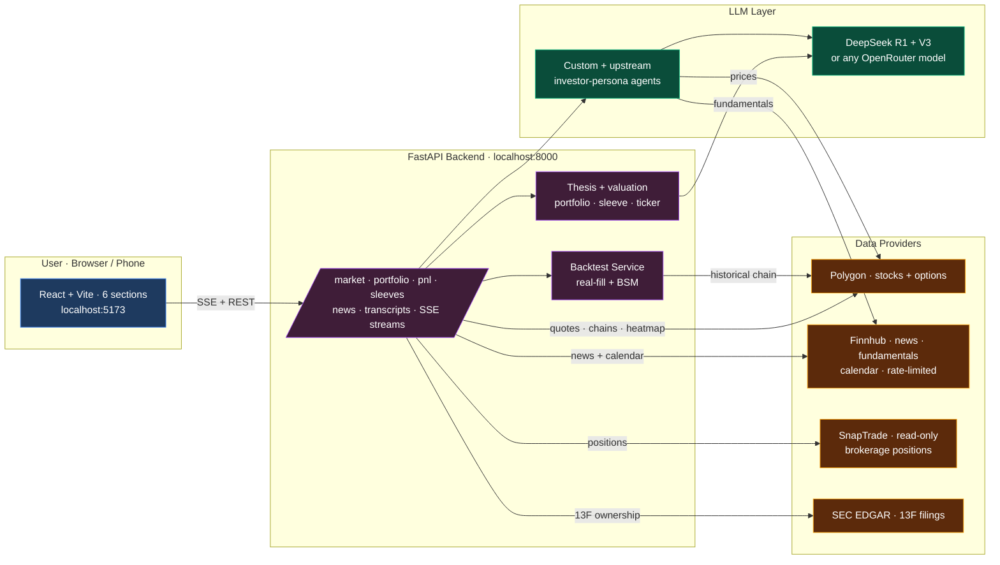

<div align="center">

# Alpha Terminal

**A research terminal for retail investors. A live market dashboard with an S&P 500 heatmap and catalyst calendar, AI agent panels that score your book, a brokerage-connected portfolio view with a 13F ownership tracker, a realistic options backtester, and a paper-trading account to practice in — all signals, no execution.**

[](CHANGELOG.md)
[](LICENSE)
[](https://www.python.org/downloads/)
[](https://nodejs.org/)
[](tests/)
[](#what-this-is-not)

</div>

> [!NOTE]
> **Version 1.21.0 — stable.** Six sections (Market, Screening, Portfolio, Paper Trading, News, Calls), a finviz-style S&P 500 treemap heatmap, a catalyst calendar (earnings + Fed/CPI/policy events), news with per-headline AI thesis-impact tags, SnapTrade brokerage sync with a 13F ownership tracker and an AI thesis backed by a valuation football field, the intraday-capable Pattern Scanner, the 11-strategy options screener + realistic backtester, and a $100k simulated options account. **New:** an **agentic AI assistant** that calls live tools (and can backtest strategies with walk-forward / Monte-Carlo / bootstrap validation and analyse your portfolio), and **Telegram phone alerts** on high-confidence scheduled scans. 517 tests passing. See the [changelog](CHANGELOG.md) for what shipped and the [Roadmap](#roadmap) for what's next.

> **Signals only — no trading execution.** Alpha Terminal generates ideas. You decide what to do with them.

---

## Contents

[What it does](#what-it-does) · [Why](#why-this-exists) · [Quick start](#quick-start-5-minutes) · [The dashboard](#the-dashboard-at-a-glance) · [Features](#features) · [Architecture](#architecture) · [Repo layout](#repository-layout) · [Setup](#detailed-setup) · [Troubleshooting](#troubleshooting) · [What it is NOT](#what-this-is-not) · [Roadmap](#roadmap) · [Changelog](CHANGELOG.md) · [Credits](#credits)

---

## What it does

Alpha Terminal sits between your watchlist and your brokerage. It gives you one place to watch the whole market, research any single name, run a panel of LLM-based "agent" analysts on your stocks, pressure-test option strategies against history, and track both your real accounts (read-only) and a simulated paper book.

```
┌────────────────────┐    ┌────────────────────┐    ┌────────────────────┐
│  Market dashboard  │    │  Agent panel       │ ─► │  Portfolio         │
│  • S&P 500 heatmap │    │  • alpha_seeker    │    │  • SnapTrade sync  │
│  • macro + movers  │    │  • damodaran       │    │  • AI thesis +     │
│  • catalyst        │    │  • burry, graham…  │    │    valuation field │
│    calendar        │    └────────────────────┘    │  • 13F ownership   │
│  • news + thesis-  │                              └────────────────────┘
│    impact tags     │
└────────────────────┘
       │
       ▼
┌────────────────────┐  ┌────────────────────┐    ┌────────────────────┐
│  Pattern Scanner   │  │  11 options        │ ─► │  Realistic options │
│  • 12 patterns     │  │  strategy screener │    │  backtester        │
│  • 4 timeframes    │  │  • adaptive strikes│    │  • profit/stop/DTE │
│  • options plays   │  │  • spread legs     │    │  • slippage model  │
│  → Paper Trading   │  │  • real chains     │    │  • real or BSM     │
└────────────────────┘  └────────────────────┘    └────────────────────┘
```

## Why this exists

Most retail tools fall in two camps:
1. **Charts + indicators** (Thinkorswim, TradingView) — beautiful price data, zero conviction synthesis.
2. **Stock screeners + AI chatbots** — generic summaries, no portfolio context, no backtest.

Alpha Terminal is built for one specific job: **"I'm a serious retail investor with a thesis. Show me the market, score my book, tell me what's working, let me test a strategy before I commit."**

---

## Quick start (5 minutes)

```bash
# 1. Clone
git clone https://github.com/ronitg1/alpha-terminal.git
cd alpha-terminal

# 2. Python deps (3.11 + Poetry)
poetry install --no-root

# 3. Frontend deps
cd app/frontend && npm install && cd ../..

# 4. Get API keys:
#    DeepSeek         https://platform.deepseek.com/  (required — LLM, ~$0.05 / agent call)
#    Polygon Stocks   https://polygon.io/  (required — free: 5 req/min, Starter ~$29/mo: unlimited)
#    Finnhub          https://finnhub.io/register  (optional but recommended — free 60/min;
#                     powers the News tab, the catalyst calendar, fundamentals/valuation,
#                     and fills Polygon's insider + growth/turnover gaps)
#    (optional) Financialdatasets.ai  https://financialdatasets.ai/  for richer ratios
#
# 5. Configure
cp .env.example .env
# edit .env with your keys

# 6. Run (two terminals)
poetry run uvicorn app.backend.main:app --host 127.0.0.1 --port 8000 --reload
cd app/frontend && npm run dev

# 7. Open http://localhost:5173
```

The app opens on the **Market dashboard**. The left sidebar has a **universal stock search**, your watchlists, your connected portfolios, and the sector list; the section buttons switch between **Market · Screening · Portfolio · Paper Trading · News · Calls**. A first-login walkthrough (replayable from the Help button) tours the whole app. Run a morning scan (`poetry run python -m src.run_morning_scan`) to populate agent verdicts.

---

## The dashboard at a glance

A three-pane terminal: a **left sidebar** (search any stock, watchlists, connected portfolios, and sector ETFs with live quotes + sparklines), a **main pane** that switches across six sections, and a context-aware **AI research assistant** panel on the right. Fully responsive — it works as a phone web app, not just on desktop.

| Section | What it's for |
| --- | --- |
| **Market** | Opens on a live dashboard: macro panel (indices, gold, oil, Bitcoin), market movers, your watchlist's top performers/laggards, a finviz-style **S&P 500 treemap heatmap** (size = market cap, colour = performance; switchable to any watchlist), a **news feed with AI thesis-impact tags**, and a **catalyst calendar** (watchlist + notable earnings, Fed/CPI/policy events). Click any tile or search a ticker for its full research page — chart, company overview, financials, fundamentals, and news. |
| **Screening** | Pattern Scanner (weekly / daily / 1h / 15m) · 11-strategy Options Screener (with chain viewer + spread-leg highlighting) · the realistic options Backtester. |
| **Portfolio** | Your real accounts, read-only via **SnapTrade** (Fidelity and most brokers) or a Robinhood MCP token. Summary (totals, sector allocation, movers, upcoming earnings, holdings news, **13F institutional-ownership tracker**), Positions (live prices, gain/loss, 52-week range bars), and **Thesis** — an AI analyst call on any holding grounded in a **valuation football field**. |
| **Paper Trading** | A simulated options account with a $100,000 starting balance. Add contracts manually or send a setup straight from the Pattern Scanner; tracks buying power, live P&L (broker-style marks), win rate, and realized gains. |
| **News** | Market-news desk with three scopes — Market (auto-categorized macro), Watchlist (your book), Ticker (any symbol) — with per-article AI summaries. |
| **Calls** | Earnings-call analysis — paste text / URL / PDF → a 9-section structured breakdown. |

---

## Features

### 📊 Market dashboard

The home screen is a market monitor, not a blank search box:

- **S&P 500 treemap heatmap** — a proper squarified treemap grouped by sector, tile size = market cap, tile colour = today's performance (red→green), built from a single bulk snapshot. A dropdown switches it to any of your watchlists with a Today/Week/Month toggle. Tap any tile to research the name.
- **Macro panel + movers** — indices, crude, treasuries, gold, Bitcoin; the day's top market gainers/losers; and your selected watchlist's top performers and laggards.
- **Catalyst calendar** — a week/month calendar with events inline in the day cells: earnings for your watchlist plus curated notable movers (AAPL, NFLX, TSLA, JPM…), and macro/policy dates (Fed, CPI, IRA-45X / FEOC deadlines).
- **News & thesis impact** — a news feed where the LLM tags each headline as **supporting or threatening** the thesis of the related holding, so you triage news by what it does to your book.

Click any ticker — from the heatmap, a watchlist, or the sidebar's **universal search** — to open its research page: price + volume chart (1W → 2Y), company overview, key financials, and a fundamentals panel (growth/turnover, analyst consensus, earnings beat/miss, peers, insider flow).

### 💼 Portfolio (real accounts, read-only)

Connect your brokerage through **SnapTrade** (Fidelity and most major brokers; OAuth — your login is never shared with the app) or a Robinhood MCP token. Switch between accounts or view them all combined, and hide dollar amounts with the eye toggle.

- **Summary** — total value, day and total gain/loss, allocation by sector, top/bottom movers, upcoming earnings for your names, holdings news, and a **13F institutional-ownership tracker**: for each holding, which of a curated set of famous funds (Berkshire, Bridgewater, Renaissance, Citadel, Pershing Square, Appaloosa, Scion/Burry, Tiger Global) hold it and how they moved last quarter — opened / added / trimmed / exited with share-count changes, live from SEC EDGAR filings.
- **Positions** — every stock, ETF, and option with live prices, gain/loss, cost basis, and a 52-week range bar, grouped with subtotals.
- **Thesis** — run an AI analyst on any holding for a bull/bear call grounded in a **valuation football field**: a mini-DCF, exit-multiple comps, and the 52-week range, sanity-clamped so a wild DCF never pins a misleading bar to the chart edge.

### 🧾 Paper Trading

A simulated options account with a **$100,000** starting balance — practice ideas with zero real money. Tracks account value, buying power, open positions' live P&L, realized gains, and win rate. Add contracts manually, or open a pattern's trade plan in the Pattern Scanner and hit **Add to Paper Trading** to enter at the current price.

Option marks are **broker-style**: live Polygon NBBO mid when the contract trades, falling back to a **Black-Scholes mark computed from Polygon's own implied vol** for illiquid or after-hours contracts — so your paper P&L tracks what your broker would show, not a stale last trade.

### 🔎 Pattern Scanner

Detects **12 classic chart patterns** on **four timeframes — weekly, daily, 1-hour, and 15-minute bars** — ranks every hit by a transparent confidence score, then — for any signal you click — shows how that pattern has historically resolved on that name and which options structures fit it.

**Patterns detected** (▲ bullish / ▼ bearish):

| ▲ Bullish | ▼ Bearish |
|---|---|
| Bullish Flag · Bull Pennant · Double Bottom · Inverse Head & Shoulders · Ascending Triangle · Cup & Handle · Falling Wedge | Head & Shoulders · Double Top · Descending Triangle · Rising Wedge · Bearish Flag |

**Confidence (0–100)** is a weighted, inspectable blend — `0.4 × breakout strength + 0.3 × volume confirmation + 0.3 × trendline-touch / symmetry` — so a clean breakout on heavy volume with several trendline touches scores high, and a marginal one scores low. Overlapping detections of the same pattern are de-duplicated (highest confidence kept).

**Run a scan.** Pick the universe from three tabs — **Watchlist**, **My Portfolios**, or **Custom** (paste any tickers) — tick which of the 12 patterns to look for, pick a **timeframe** (Weekly for long-base/position setups over months, Daily for swing setups, 1h for multi-day swings, 15m for day-trade setups) and a lookback sized to it, and scan. Intraday bars are **regular-trading-hours only** (premarket noise is filtered) and timestamps read in **US-Eastern exchange time**. Results come back as a confidence-sorted table with "Today's plays" sorting and filter chips.

**Drill into any signal.** Click a row to open a full-screen chart — candlesticks plus a synced volume histogram on the scan's timeframe, every detected pattern flagged with an entry arrow, and the selected pattern's **trendlines drawn directly on the chart** (pole, channel, neckline, cup walls, wedge lines) with dashed **key-level** price lines labelled on the axis.

**Signal Analysis side panel** answers "is this pattern worth trading on this name?":

- **Historical win rate** — a backtest of that exact ticker + pattern *on the scan's timeframe*. A signal counts as a *win* if price posts a favourable move within 20 bars that clears the timeframe's threshold — **3%** on daily, **1.5%** on 1h, **0.75%** on 15m. Recent signals without 20 forward bars are excluded so the rate isn't inflated.
- **Options plays** — three graded structures matched to the pattern's direction, each with a concrete strike, a suggested DTE, the rationale, risk/reward, a **risk-sized trade plan** (buy/cut/take-profit premiums, contract sizer), and a one-click **Add to Paper Trading**.

### 📈 Options screener (11 strategies)

| Strategy | Setup |
|---|---|
| **Weakness** | Lagging QQQ + oversold (bounce calls or continuation puts) |
| **Strength** | Leading QQQ + overbought (breakout calls or mean-reversion puts) |
| **Momentum** | Absolute trend follow, no benchmark |
| **Mean Reversion** | Z-score from 20d mean |
| **Breakout** | Near 52w high + volume confirm |
| **Breakdown** | Near 52w low + volume confirm |
| **Volume Spike** | Unusual volume + big move + close-at-wick |
| **Pullback** | Buy-the-dip-in-uptrend |
| **Trend Bias** | Golden/Death cross context |
| **Vol Expansion** | Realized-vol regime change |
| **Unusual Options Activity** | Live chain vol/OI extremes |

Each strategy ships a **strike + expiry recommendation** that **adapts to your picked expiry** — a +2% OTM call at 7d becomes ~+5% OTM at 50d via √-time strike scaling, same statistical reach across maturities. Click any candidate to drop into the chain viewer (calls/puts, ATM-highlighted) with the recommended contract starred; multi-leg structures (e.g. debit spreads) highlight **both** legs with BUY/SELL tags, and the "Plays" pills jump the chain to each expiry tier.

### 🧪 Backtest engine (two modes)

**Strategy mode** — run any of the 10 backtestable options strategies against the screener's historical signals. Two pricing modes:

- **Real fills (Polygon)** — fetches the actual listed contract closest to the strategy's target strike + expiry (~2.5× hold-days out), then entry/exit at the actual daily close. Falls back to BSM per-trade if the contract or bar is missing.
- **BSM proxy** — Black-Scholes against the underlying's trailing 30-day realized vol. Deterministic, no API calls. Useful for ranking strategies.

**Realistic exit model** — every trade is checked each day and closes on the first trigger: **profit target** (default +50%), **stop-loss** (default −50%), **DTE roll-out** (default 21 DTE, to step out before the gamma/theta cliff), or the **hold-days backstop**. A **slippage** model (default 5% round-trip spread) crosses half the bid/ask on each side, so frictionless win rates don't mislead. The trades table shows the **exact entered contract** (strike + expiry) with entry/exit dates, and the summary breaks trades down by how they closed. A "reality check" banner flags when BSM or frictionless settings are inflating results.

**Sleeves mode** — wraps the LLM agent panel into a backtest. Each trading day, the full agent panel votes; portfolio positions follow the consensus. Equity curve with trade markers, closed-trades table with per-agent attribution.

**Strategy backtest with statistical validation** (`src/backtesting/vibe_engine/`, an event-driven engine ported from the MIT-licensed [HKUDS/Vibe-Trading](https://github.com/HKUDS/Vibe-Trading) — see [THIRD_PARTY_NOTICES.md](THIRD_PARTY_NOTICES.md)) — turns chart-pattern detections into a next-bar-open long/short strategy and reports Sharpe / Sortino / Calmar / max-drawdown / win-rate **plus walk-forward consistency, a Monte-Carlo permutation p-value, and a bootstrap Sharpe confidence interval**. Look-ahead-safe (signals fill on the next bar's open). Driven from the AI assistant (`backtest_strategy` / `backtest_portfolio`); daily bars today.

### 🛠 Custom agents

Three custom agents written specifically for this project, in addition to the 19 upstream investor-persona agents:

- **`alpha_seeker`** — sector-agnostic alpha generation. Two-tier framing: STRONG EDGE requires a full variant perception ("Consensus is wrong because X"); DIRECTIONAL LEAN allows lower-conviction reads grounded in momentum + fundamentals + news flow.
- **`energy_transition`** — IRA tax-credit + FEOC compliance scorecard. Allowed to use industry knowledge to infer FEOC status when news flow is silent (e.g., FSLR thin-film → clean; Chinese-cell inverter shops → amber/red).
- **`emerging_tech`** — moat + S-curve + AI-tailwind + valuation scorecard. Calibrated confidence anchors (70-90 for full alignment, 30-50 for thin data).

Your book is organized into themed **sleeves**, each scored by its own agent panel via the morning scan (CLI or scheduled). LLM thesis synthesis runs at three scopes — whole-portfolio, per-sleeve, and per-name — each grounded in the scan signals + fundamentals.

### 📰 News + AI thesis impact

Three news scopes — **Market** (auto-categorized macro: Monetary / Geopolitics / Government / Economy / Energy / Markets), **Watchlist** (headlines fanned across your tickers), and **Ticker** (any symbol) — with per-article **AI summaries** ("3 bullets + why it matters to your book"). On the Market dashboard and Portfolio summary, the LLM additionally tags each headline as **supporting or threatening** the related holding's thesis. Finnhub-primary with a Polygon fallback for per-ticker news.

### 🎙 Earnings Call Analysis

Paste a transcript, paste a URL, or upload a PDF; the analysis returns a 9-section structured read: sentiment vs prior quarter, tone delta, key themes with quotes, **hedging-language flags**, **dodged-question detection**, competitive + regulatory (IRA 45X / FEOC / tariff) mentions, and an explicit **thesis-impact verdict** (confirms / strengthens / weakens / breaks). URL extraction uses httpx + BeautifulSoup; PDF parsing uses pypdf.

### 🤖 Agentic AI research assistant

A **tool-calling agent** (LangGraph `create_react_agent`) — not a one-shot chat. It grounds answers by calling the app's own tools live: quotes, pattern scans, signal win-rates, trade plans, market movers/indices, the catalyst calendar, ticker news, your portfolio overview + Sharpe stats, 13F ownership, valuations — and it can **run backtests** and **analyse your whole portfolio** on request. Ask "what patterns are firing on my watchlist?", "backtest a bull-flag strategy on NVDA and AMD", or "analyse my portfolio", and it runs the scan / backtest / analytics and synthesizes the result. Tool activity streams into the chat as small "using…" chips; answers stream token-by-token. The loop runs on DeepSeek **V3** (a saved R1 preference is auto-swapped for reliable tool-calling); bring your own key (DeepSeek or any OpenRouter model). Signals only — it never places trades.

### 🔔 Telegram alerts

Get high-confidence signals **pushed to your phone**. When a scheduled scan turns up a signal at or above your confidence threshold on an enabled timeframe, the terminal messages you via your own Telegram bot — one batched message per scan (e.g. "NVDA — Bull Flag · 93% 🟢"). Set it up in **Settings → Alerts**: connect your bot (BotFather), pair with a one-time code, then pick the threshold (default 90%) and timeframes (default Daily + 1h). A dedup ledger keeps the recurring cron from re-pinging you for the same play. The bot token is BYOK, encrypted at rest.

### 🔌 Finnhub free-tier fallback (optional)

When `FINNHUB_API_KEY` is set, Finnhub backfills the gaps in a Polygon-only plan: **insider (Form 4) transactions**, the **growth / turnover / DSO ratios** Polygon's `/ratios` omits, and the **financial statements** valuation needs. It also powers the News tab, the earnings/catalyst calendar, the fundamentals grid, analyst consensus, and peers. Strictly additive — the app runs without the key. All Finnhub traffic goes through a shared token-bucket rate limiter to stay under the free-tier ceiling.

---

## Architecture



Runs **local-first** with file storage and no login. An optional cloud profile (`STORAGE_BACKEND=db` + Clerk auth) turns the same codebase into a multi-tenant deployment with per-user encrypted BYOK API keys and scheduled pre-scans — the local app is unchanged when those flags are off.

### Per-data-type provider routing

The data providers have different sweet spots. Alpha Terminal routes each data type to the right one, with fallbacks:

| Data | Primary | Fallback | Why |
|---|---|---|---|
| Prices / quotes / heatmap | Polygon | FDS | Polygon covers full US universe; bulk snapshot for the treemap |
| Company news | Finnhub | Polygon | Finnhub's per-ticker + macro feeds are richer |
| Earnings + catalyst calendar | Finnhub | — | Free-tier `/calendar/earnings` |
| Fundamentals / valuation inputs | Finnhub `metric/all` + statements | FDS | Polygon's Starter plan gates `/financials` |
| Growth / turnover ratios | FDS | **Finnhub** | Polygon `/ratios` omits these |
| Insider trades | FDS | **Finnhub** | Polygon doesn't publish them |
| Brokerage positions | SnapTrade | Robinhood MCP | Read-only OAuth, no credential scraping |
| 13F ownership | SEC EDGAR | — | Direct from filings, matched by issuer name |
| Options chain | Polygon | — | Polygon Options plan only |

Finnhub access is gated behind a single process-wide token-bucket limiter shared across every caller, so heavy navigation never trips a 429. Set neither `DATA_PROVIDER` nor both keys and the routing degrades gracefully — whichever provider you have, the dashboard still renders the data it can.

---

## Repository layout

```
alpha-terminal/
├── README.md                ← you are here
├── ARCHITECTURE.md          ← contributors' deep dive
├── CONTRIBUTING.md
├── ATTRIBUTION.md           ← what came from virattt/ai-hedge-fund
├── LICENSE                  ← MIT
├── .env.example             ← copy + fill in
│
├── src/                     ← Python core
│   ├── agents/                  19 upstream + 3 custom analysts
│   │   ├── alpha_seeker.py          (custom) sector-agnostic alpha
│   │   ├── energy_transition.py     (custom) IRA + FEOC scorecard
│   │   ├── emerging_tech.py         (custom) moat + S-curve + AI
│   │   └── …
│   ├── backtesting/
│   │   ├── options_historical.py    real Polygon fills
│   │   ├── options_proxy.py         BSM walk-forward
│   │   └── sleeve_attribution.py    per-agent + per-sleeve attribution
│   ├── config/
│   │   ├── portfolio_config.py      sleeve definitions
│   │   └── watchlist.py             opportunistic queue
│   ├── tools/
│   │   ├── api.py                   per-type provider routing
│   │   ├── massive/                 Polygon REST client
│   │   └── finnhub/                 Finnhub client (rate-limited) + converters
│   └── run_morning_scan.py          CLI entry point
│
├── app/
│   ├── backend/                 FastAPI
│   │   ├── routes/                  market, portfolio, pnl, sleeves, news,
│   │   │                            transcripts, snaptrade, scheduled, auth
│   │   ├── services/                heatmap, catalyst calendar, news impact,
│   │   │                            portfolio overview, 13F ownership, thesis
│   │   │                            valuation, paper-trading pnl, finnhub news
│   │   ├── repositories/            Postgres stores (cloud profile)
│   │   └── models/                  events + schemas
│   └── frontend/                React + Vite (phone-friendly)
│       └── src/
│           ├── components/dashboard/    3-pane shell: left nav + search,
│           │                            market dashboard (heatmap, calendar,
│           │                            news impact), portfolio, paper trading
│           ├── components/sleeves/      screener, chain viewer, backtest
│           ├── components/news/         News section
│           ├── components/transcripts/  Calls section
│           ├── components/onboarding/   first-login walkthrough + tour
│           ├── contexts/                dashboard + sleeves state
│           └── services/                typed API clients
│
├── tests/                   ← 517 tests, pytest
└── outputs/                 ← scan CSVs + JSON sidecars (gitignored)
```

---

## Detailed setup

### Required: Python 3.11 + Poetry

```bash
# macOS
brew install python@3.11 pipx
pipx install poetry

# Windows
choco install python --version=3.11
pip install pipx
pipx install poetry

# Linux
sudo apt install python3.11 python3.11-venv
curl -sSL https://install.python-poetry.org | python3 -
```

### Required: Node 18+

```bash
# macOS
brew install node

# Windows
choco install nodejs

# Linux
curl -fsSL https://deb.nodesource.com/setup_20.x | sudo -E bash -
sudo apt install -y nodejs
```

### API keys — where to get each

| Key | Required? | What for | How to get |
|---|---|---|---|
| `DEEPSEEK_API_KEY` | ✅ Default | Agent reasoning (R1) + structured output parsing (V3) | https://platform.deepseek.com → API Keys |
| `OPENROUTER_API_KEY` | 🟡 Optional LLM alternative | Enables Settings → LLM model selection for any OpenRouter model id | https://openrouter.ai/settings/keys |
| `MASSIVE_API_KEY` | ✅ Yes | Prices, quotes, heatmap, market cap, options chain | https://polygon.io → Dashboard → API Keys |
| `FINNHUB_API_KEY` | 🟡 Strongly recommended | News, catalyst/earnings calendar, fundamentals + valuation inputs, analyst consensus, insider trades, peers — **the agents see real data on a Polygon-only plan because of this key** | https://finnhub.io/register (free, 60/min) |
| `FINANCIAL_DATASETS_API_KEY` | ⚪ Optional | Alternative fundamentals provider (richer line-items) | https://financialdatasets.ai → Settings |
| `SNAPTRADE_CLIENT_ID` / `SNAPTRADE_CONSUMER_KEY` | ⚪ Optional | Read-only brokerage sync for the Portfolio section | https://snaptrade.com → dashboard |
| `ROBINHOOD_MCP_BEARER_TOKEN` | ⚪ Optional | Read-only Robinhood portfolio pull through MCP; users can also save their own token in Settings | https://agent.robinhood.com/mcp/trading |
| `ANTHROPIC_API_KEY` | ⚪ Optional | Powers the news thesis-impact tagging when set | https://console.anthropic.com → API Keys |

`DEEPSEEK_API_KEY` (or a saved OpenRouter key/model in Settings) + `MASSIVE_API_KEY` is the bare minimum, **but add `FINNHUB_API_KEY` too** — Polygon's Starter plan doesn't include the fundamentals/ratios add-on, so without Finnhub (or FDS) the agents reason over null fundamentals and report "no edge," and the calendar/valuation panels stay empty. Finnhub's free tier fills all of that.

### Configuring sleeves

Sleeves are defined in [`src/config/portfolio_config.py`](src/config/portfolio_config.py). Each sleeve names its own agent panel, the per-agent weights used to combine signals, and its tickers:

```python
PORTFOLIO_SLEEVES = {
    "energy_transition": {
        "allocation_pct": 50.0,                       # informational (see note)
        "agents": ["energy_transition", "aswath_damodaran", "michael_burry"],
        "agent_weights": {                            # must sum to 1.0
            "energy_transition": 0.3333,
            "aswath_damodaran": 0.3333,
            "michael_burry": 0.3334,
        },
        "tickers": ["FSLR", "CSIQ", "JKS", "ENPH", "..."],
    },
    "mega_tech": {"...": "..."},
    "emerging_tech": {"...": "..."},
    "opportunistic": {"...": "..."},
}
```

Edit this file directly, or use the **Manage watchlists & portfolios panel** on the Market dashboard — edits rewrite the file atomically and live-reload the backend.

Two invariants are enforced at import (`validate_portfolio`): per-sleeve `agent_weights` must sum to **1.0**, and total `allocation_pct` may not exceed 100%. Note that `allocation_pct` is **informational** — nothing in the scan computes against it, so sleeves don't have to sum to exactly 100% and you can add/delete them freely.

---

## Troubleshooting

<details>
<summary><strong>Vite or uvicorn shows "Application startup complete" but new routes 404</strong></summary>

uvicorn's `--reload` is fragile after many rapid file edits. Restart the process:

```bash
# Find the PID, kill, restart
netstat -ano | findstr :8000    # Windows
lsof -i :8000                    # macOS/Linux
```

</details>

<details>
<summary><strong>Blank screen after a tab crashes</strong></summary>

The `<TabErrorBoundary>` should catch this and show "This tab failed to render". If you see a fully white page, it's a pre-mount crash. Reset persisted tab state:

```javascript
// In browser DevTools console
localStorage.clear()
location.reload()
```

</details>

<details>
<summary><strong>Agents say "no momentum, no fundamentals, no news"</strong></summary>

That's the data layer failing, not the agents. Check:
1. `DATA_PROVIDER` in `.env` — if set to `fds`, smaller-cap tickers will return empty. Either unset it or set to `massive`.
2. Polygon plan tier — you need at least **Stocks Advanced** for aggregates + news.
3. `FINNHUB_API_KEY` — on a Polygon-only plan this is what supplies fundamentals.
4. The ticker symbol — Polygon uses class-share suffixes for some names (`BRK.B`, `GOOG` vs `GOOGL`).
</details>

<details>
<summary><strong>The S&P 500 heatmap or 13F panel is slow the first time</strong></summary>

Both warm a server-side cache on first load (bulk snapshot enrichment; per-fund EDGAR filings). The heatmap caches for hours and the 13F for a day, so subsequent loads are instant.
</details>

<details>
<summary><strong>Options backtest in "real fills" mode shows all trades as synthetic</strong></summary>

You don't have a Polygon Options plan, or Polygon doesn't have historical chain data for the ticker in your date window. The dashboard logs a per-trade fallback to BSM. Switch the toggle to **BSM proxy** for a cleaner result, or upgrade to **Polygon Options Starter** (~$30/mo).
</details>

---

## What this is NOT

- **Not a brokerage.** No trade execution — brokerage connections are strictly read-only, and the paper account is simulated. The agents tell you what they think; you trade through your own broker.
- **Not financial advice.** Open source software written by one person. Use it as a research tool. Backtest your strategies. Risk-manage your positions.
- **Not a guarantee of returns.** The LLMs are pattern-matchers. They are wrong sometimes. Read the `kill_switch` field on every agent verdict for what would invalidate the trade.
- **Not a hosted product.** Designed to run local-first on your laptop with file storage and no login. (A cloud profile with auth + Postgres exists for personal multi-device use, but you deploy and pay for it yourself.)

---

## Roadmap

Track via [GitHub issues](https://github.com/ronitg1/alpha-terminal/issues).

**Recently shipped**

- [x] **1.18** — **agentic AI assistant** (LangGraph tool-calling over the app's live data); **backtesting with statistical validation** (walk-forward / Monte-Carlo / bootstrap, ported from the MIT-licensed HKUDS/Vibe-Trading) driven from chat; an **"analyse my portfolio"** agent tool
- [x] **1.17** — **Telegram phone alerts** on high-confidence scheduled scans (BYOK bot, per-user threshold + timeframes, dedup)
- [x] **1.16** — **per-schedule timeframe + lookback** on scheduled scans; pre-scans kept **per timeframe** (in-process scheduler replaces the external cron)
- [x] **1.15** — **approximate Sharpe ratio** on the Portfolio summary (current weights × 1y of daily returns) and the Paper Trading account bar (realized equity curve)
- [x] **1.14** — finviz-style **S&P 500 treemap heatmap**; notable-mover earnings folded into the **catalyst calendar**; refreshed onboarding walkthrough
- [x] **1.13** — **13F institutional-ownership tracker** (live SEC EDGAR, quarter-over-quarter fund moves); broker-style **BSM(IV) option marks** for illiquid contracts
- [x] **1.12** — Market tab rebuilt as a **dashboard** (macro, movers, calendar, news + AI thesis-impact); universal stock search; **thesis valuation football field** (mini-DCF + comps + 52-wk); portfolio overview caching
- [x] **1.9–1.11** — **SnapTrade** read-only brokerage sync (Portfolio Summary / Positions / Thesis); **Paper Trading** (renamed from P&L; simulated $100k options account); News tab restructured into Market / Watchlist / Ticker; scheduled pre-scans; onboarding walkthrough + interactive tour; cloud profile (Clerk auth, Postgres storage, encrypted BYOK keys)
- [x] **1.2–1.8** — risk-sized trade plans on options plays; intraday Pattern Scanner (1h/15m); realistic options backtester (profit/stop/DTE exits + slippage); Market News + earnings-call desks; Finnhub integration; per-name/per-sleeve/whole-portfolio LLM thesis

**Up next**

- [ ] 🔔 **Price + signal alerts** — threshold + conviction-change notifications
- [ ] 🧾 **Trade journal** — attach notes/rationale to each idea, linked to its agent thesis
- [ ] Trailing / peak-drawdown stop-loss mode in the backtester (currently fixed-% from entry)
- [ ] Sleeve sparkline history + diff highlight vs the previous scan
- [ ] Cost meter — running tally of LLM credits per session

---

## Credits

Built on the shoulders of [`virattt/ai-hedge-fund`](https://github.com/virattt/ai-hedge-fund) (MIT). The 19 upstream investor-persona agents (Warren Buffett, Aswath Damodaran, Stanley Druckenmiller, Ben Graham, Charlie Munger, Michael Burry, Phil Fisher, etc.) come from there essentially unchanged. The custom analysts, the six-section dashboard (market monitor, heatmap, catalyst calendar, news thesis-impact), the brokerage-connected portfolio view with 13F tracking and thesis valuation, the options screener, the realistic options backtester, the paper-trading account, the Market News + earnings-call desks, the Finnhub integration, and the per-type data routing are new in this project.

See [ATTRIBUTION.md](ATTRIBUTION.md) for the full diff.

---

## License

MIT — see [LICENSE](LICENSE). Use it, fork it, change it, sell it. Just don't blame me if your trades lose money.
