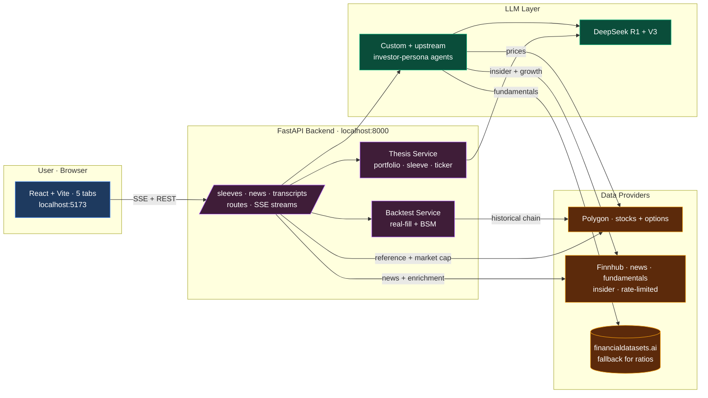
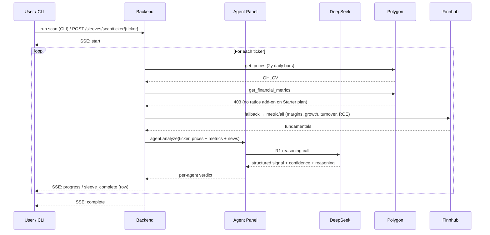

<div align="center">

# Alpha Terminal

**A research terminal for retail investors. AI agent panels score your book, a realistic options backtester pressure-tests your strategies, and a market-news + earnings-call desk keeps you on top of every name — all from your laptop.**

[](CHANGELOG.md)
[](LICENSE)
[](https://www.python.org/downloads/)
[](https://nodejs.org/)
[](tests/)
[](#what-this-is-not)

</div>

> [!NOTE]
> **Version 1.4 — stable.** The six tabs (Market, Screening, Portfolio, P&L, News, Calls), the options screener + realistic backtester (now runnable off any portfolio or watchlist), the intraday-capable Pattern Scanner with its own options backtest + optimizer, the P&L tracker with Fidelity import, and the Finnhub fundamentals integration are feature-complete and tested (233 passing). See the [changelog](CHANGELOG.md) for what shipped and the [Roadmap](#roadmap) for what's next.

> **Signals only — no trading execution.** Alpha Terminal generates ideas. You decide what to do with them.

---

## Contents

[What it does](#what-it-does) · [Why](#why-this-exists) · [Quick start](#quick-start-5-minutes) · [The dashboard](#the-dashboard-at-a-glance) · [Features](#features) · [Architecture](#architecture) · [Repo layout](#repository-layout) · [Setup](#detailed-setup) · [Troubleshooting](#troubleshooting) · [What it is NOT](#what-this-is-not) · [Roadmap](#roadmap) · [Changelog](CHANGELOG.md) · [Credits](#credits)

---

## What it does

Alpha Terminal sits between your watchlist and your brokerage. It runs a panel of LLM-based "agent" analysts on your stocks, organizes them into themed sleeves, and gives you the tools to pressure-test ideas before risking capital.

```
┌────────────────────┐    ┌────────────────────┐    ┌────────────────────┐
│  Your tickers      │ ─► │  Agent panel       │ ─► │  Portfolio Pulse   │
│  • sleeves         │    │  • alpha_seeker    │    │  • per-agent cards │
│  • watchlists      │    │  • damodaran       │    │  • Finnhub snapshot│
│  • sector ETFs     │    │  • burry, graham…  │    │  • LLM idea synth  │
└────────────────────┘    └────────────────────┘    └────────────────────┘
       │                                                      │
       ▼                                                      ▼
┌────────────────────┐  ┌────────────────────┐    ┌────────────────────┐
│  Market News +     │  │  11 options        │ ─► │  Realistic options │
│  Earnings Calls    │  │  strategy screener │    │  backtester        │
│  • macro buckets   │  │  • adaptive strikes│    │  • profit/stop/DTE │
│  • 9-section call  │  │  • spread legs     │    │  • slippage model  │
│    breakdown       │  │  • real chains     │    │  • real or BSM     │
└────────────────────┘  └────────────────────┘    └────────────────────┘
```

## Why this exists

Most retail tools fall in two camps:
1. **Charts + indicators** (Thinkorswim, TradingView) — beautiful price data, zero conviction synthesis.
2. **Stock screeners + AI chatbots** — generic summaries, no portfolio context, no backtest.

Alpha Terminal is built for one specific job: **"I'm a serious retail investor with a thesis. Score my book, tell me what's working, let me test a new strategy before I commit."**

---

## Quick start (5 minutes)

```bash
# 1. Clone
git clone https://github.com/ronitg1/alpha-terminal.git
cd alpha-terminal

# 2. Python deps (3.12 + Poetry)
poetry install --no-root

# 3. Frontend deps
cd app/frontend && npm install && cd ../..

# 4. Get API keys:
#    DeepSeek         https://platform.deepseek.com/  (required — LLM, ~$0.05 / agent call)
#    Polygon Stocks   https://polygon.io/  (required — free: 5 req/min, Starter ~$29/mo: unlimited)
#    Finnhub          https://finnhub.io/register  (optional but recommended — free 60/min;
#                     powers the News tab, earnings-beat/insider data, and fills Polygon's
#                     insider + growth/turnover gaps)
#    (optional) Financialdatasets.ai  https://financialdatasets.ai/  for richer ratios
#
# 5. Configure
cp .env.example .env
# edit .env with your keys

# 6. Run (two terminals)
poetry run uvicorn app.backend.main:app --host 127.0.0.1 --port 8000 --reload
cd app/frontend && npm run dev

# 7. Open http://localhost:5173
```

The dashboard opens on the **Market** tab. The left rail lists your sleeves, watchlists, and sector ETFs with live quotes; the top tabs switch between **Market · Screening · Portfolio · P&L · News · Calls**. Run a morning scan (`poetry run python -m src.run_morning_scan`) to populate Portfolio Pulse with agent verdicts.

---

## The dashboard at a glance

A three-pane terminal: a **left rail** (sleeves, watchlists, and sector ETFs with live quotes + sparklines + company names), a **main pane** that switches across six tabs, and a context-aware **AI chat** drawer.

| Tab | What it's for |
| --- | --- |
| **Market** | Per-ticker chart (price + volume), company overview, key financials, and a Finnhub fundamentals panel (growth/turnover, analyst consensus, earnings beat/miss, peers, insider flow). |
| **Screening** | Pattern Scanner (weekly / daily / 1h / 15m) · 11-strategy Options Screener (with chain viewer + spread-leg highlighting) · the realistic options Backtester. |
| **Portfolio** | Portfolio Pulse — conviction rollup, high-conviction names, whole-portfolio + per-sleeve + per-name LLM thesis, and per-name agent deep dives. |
| **P&L** | Track contracts you take or like — manual entry, one-click Track from any chain row, or Fidelity CSV import. Live mark-to-market, realized + unrealized totals, win rate, equity curve. |
| **News** | Three-column market-news desk (your book · ticker search · auto-categorized macro) with per-article AI summaries. |
| **Calls** | Earnings-call analysis — paste text / URL / PDF → a 9-section structured breakdown. |

**Portfolio Pulse** is the home base:

```
┌──────────────────────────────────────────────────────────────────────────────┐
│ 📊 Portfolio Pulse                                                            │
│    Scan: 2026-05-28 · 4 signals                                               │
├──────────────────────────────────────────────────────────────────────────────┤
│   Positions     Bullish     Bearish     Neutral     Avg Conviction            │
│      26            8            5           13           61%                  │
├──────────────────────────────────────────────────────────────────────────────┤
│  HIGH CONVICTION                                                              │
│  ┌─────────┐ ┌─────────┐ ┌─────────┐ ┌─────────┐ ┌─────────┐                 │
│  │ NVDA    │ │ FSLR    │ │ MU      │ │ CEG     │ │ ENPH    │                 │
│  │ bullish │ │ bullish │ │ bearish │ │ bullish │ │ bearish │                 │
│  │ $222.82 │ │ $311.01 │ │$1064.10 │ │ $241.80 │ │ $72.33  │                 │
│  │ ▓▓▓▓░ 78│ │ ▓▓▓░ 64 │ │ ▓▓▓░ 60 │ │ ▓▓▓▓ 81 │ │ ▓▓░ 55  │                 │
│  │ mega tech│ │ energy │ │opportun.│ │ energy  │ │ energy  │                 │
│  └─────────┘ └─────────┘ └─────────┘ └─────────┘ └─────────┘                 │
├──────────────────────────────────────────────────────────────────────────────┤
│  Portfolio Thesis                                          [✦ Run full thesis]│
│  Full LLM analysis across every sleeve                                        │
├──────────────────────────── BY SLEEVE ──────────────────────────────────────┤
│ ▼ Mega Tech   7 positions   4 bullish · 3 neutral        20% alloc [✦ Run thesis]│
│   ▓▓▓▓▓▓▓░░░  (signal mix bar)                                                │
│   › ▌bullish▐ NVDA   Oversold mega-cap lagging QQQ — bounce…   $222.82  -0.69% │
│   › ▌neutral▐ MSFT   No thesis — run a scan.                   $441.31  -4.17% │
│   › ▌neutral▐ GOOGL  No thesis — run a scan.                   $361.85  -3.38% │
│                                                                               │
│ ▶ Energy Transition  18 positions   50% alloc            [✦ Run thesis]       │
│ ▶ Emerging Tech      13 positions   20% alloc            [✦ Run thesis]       │
│ ▶ Opportunistic       4 positions   10% alloc            [✦ Run thesis]       │
└──────────────────────────────────────────────────────────────────────────────┘
```

The left rail (not shown) lists every sleeve, watchlist, and the 10 SPDR sector ETFs with live price, % change, a sparkline, and the company name. Each sleeve has a **Run thesis** button; the top **Portfolio Thesis** card runs the whole-book analysis.

Click any ticker row to expand its **deep dive** — built for idea generation, not just numbers:

1. **Finnhub snapshot strip** — analyst consensus, earnings beat/miss, growth, margin, P/E, insider flow.
2. **Agent verdict cards** — one per analyst, each with a bull/bear/neutral pill, confidence bar, full reasoning, and (for the custom agents) the edge thesis, catalysts, and kill-switch. Hit **Run agents** to score a single name on demand (ephemeral — it never overwrites the saved morning scan). Agents read fundamentals through the provider chain, so on a Polygon-only plan they fall back to Finnhub's `metric/all` rather than reasoning over null data.
3. **Idea synthesis** — a one-click **Quick take** (fast DeepSeek thesis) or **Deep analysis** (richer, multi-section, pulls recent news), both grounded in the agent signals *and* the Finnhub fundamentals.

---

## Features

### 🎯 Portfolio Pulse + sleeves

Your book is organized into themed **sleeves** ("Energy Transition 50% / Mega Tech 20% / Emerging Tech 20% / Opportunistic 10%"), each scored by its own agent panel. Portfolio Pulse rolls them up: a metrics bar (positions, bull/bear/neutral counts, average conviction), a **High Conviction** strip of the top names, and per-sleeve groups you can expand. LLM thesis synthesis is available at three scopes — **whole-portfolio** ("Run full thesis"), **per-sleeve** ("Run thesis" on any sleeve), and **per-name** (Quick take / Deep analysis in the deep dive) — each a first-person-PM read grounded in the scan signals + Finnhub fundamentals, cached server-side by scan signature.

### 🔎 Pattern Scanner

Detects **12 classic chart patterns** on **four timeframes — weekly, daily, 1-hour, and 15-minute bars** — ranks every hit by a transparent confidence score, then — for any signal you click — shows how that pattern has historically resolved on that name and which options structures fit it.

**Patterns detected** (▲ bullish / ▼ bearish):

| ▲ Bullish | ▼ Bearish |
|---|---|
| Bullish Flag · Bull Pennant · Double Bottom · Inverse Head & Shoulders · Ascending Triangle · Cup & Handle · Falling Wedge | Head & Shoulders · Double Top · Descending Triangle · Rising Wedge · Bearish Flag |

**Confidence (0–100)** is a weighted, inspectable blend — `0.4 × breakout strength + 0.3 × volume confirmation + 0.3 × trendline-touch / symmetry` — so a clean breakout on heavy volume with several trendline touches scores high, and a marginal one scores low. Overlapping detections of the same pattern are de-duplicated (highest confidence kept).

**Run a scan.** Pick the universe from three tabs — **Watchlist** (all or one named list), **My Sleeves** (all or one sleeve), or **Custom** (paste any tickers) — tick which of the 12 patterns to look for, pick a **timeframe** (Weekly for long-base/position setups over months, Daily for swing setups, 1h for multi-day swings, 15m for day-trade setups) and a lookback sized to it (up to 5yr weekly, 2yr daily, 90d hourly, 30d on 15m), and scan. Intraday bars are **regular-trading-hours only** (premarket noise is filtered) and timestamps read in **US-Eastern exchange time**. Results come back as a confidence-sorted table next to a **Quick Stats** card: total signals, average confidence, bullish-vs-bearish split, and the top tickers by signal count.

**Drill into any signal.** Click a row to open a full-screen chart — candlesticks plus a synced volume histogram on the scan's timeframe, every detected pattern flagged with an entry arrow and a confidence marker, and the selected pattern's **trendlines drawn directly on the chart** (pole, channel, neckline, cup walls, wedge lines) with dashed **key-level** price lines (resistance / support / neckline) labelled on the axis.

**Signal Analysis side panel** answers "is this pattern worth trading on this name?":

- **Historical win rate** — a backtest of that exact ticker + pattern *on the scan's timeframe* (730 days of daily bars, 180 days of hourly, 60 days of 15m). A signal counts as a *win* if price posts a favourable move within 20 bars that clears the timeframe's threshold — **3%** on daily, **1.5%** on 1h, **0.75%** on 15m — so "win" stays meaningful as bars shrink. Recent signals that don't yet have 20 forward bars are excluded so the rate isn't inflated. Shows win rate (as a gauge), total signals, the W/L split, and average win / loss size.
- **Options plays** — three graded structures matched to the pattern's direction (**Long Call / Bull Call Spread / Cash-Secured Put** for bullish; **Long Put / Bear Put Spread / Covered Call** for bearish), each with a concrete strike (rounded to listed increments off the current price), a suggested DTE, the rationale, risk/reward, and the IV-rank regime it works best in.

### 📈 Options screener (11 strategies)

| Strategy | Setup |
|---|---|
| **Weakness** | Lagging QQQ + oversold (bounce calls or continuation puts) |
| **Strength** | Leading QQQ + overbought (breakout calls or mean-reversion puts) |
| **Momentum** | Absolute trend follow, no benchmark |
| **Mean Reversion** | Z-score from 20d mean |
| **Breakout** | Near 52w high + volume confirm |
| **Breakdown** | Near 52w low + volume confirm |
| **Volume Spike** | Unusual volume + big move + close-at-wick |
| **Pullback** | Buy-the-dip-in-uptrend |
| **Trend Bias** | Golden/Death cross context |
| **Vol Expansion** | Realized-vol regime change |
| **Unusual Options Activity** | Live chain vol/OI extremes |

Each strategy ships a **strike + expiry recommendation** that **adapts to your picked expiry** — a +2% OTM call at 7d becomes ~+5% OTM at 50d via √-time strike scaling, same statistical reach across maturities. Click any candidate to drop into the chain viewer (calls/puts, ATM-highlighted) with the recommended contract starred; multi-leg structures (e.g. debit spreads) highlight **both** legs with BUY/SELL tags, and the "Plays" pills jump the chain to each expiry tier.

### 🧪 Backtest engine (two modes)

**Strategy mode** — run any of the 10 backtestable options strategies against the screener's historical signals. Two pricing modes:

- **Real fills (Polygon)** — fetches the actual listed contract closest to the strategy's target strike + expiry (~2.5× hold-days out), then entry/exit at the actual daily close. Falls back to BSM per-trade if the contract or bar is missing.
- **BSM proxy** — Black-Scholes against the underlying's trailing 30-day realized vol. Deterministic, no API calls. Useful for ranking strategies.

**Realistic exit model** — every trade is checked each day and closes on the first trigger: **profit target** (default +50%), **stop-loss** (default −50%), **DTE roll-out** (default 21 DTE, to step out before the gamma/theta cliff), or the **hold-days backstop**. A **slippage** model (default 5% round-trip spread) crosses half the bid/ask on each side, so frictionless win rates don't mislead. The conviction gate is **percentage-based** (magnitude-weighted, not a 0–3 count), the trades table shows the **exact entered contract** (strike + expiry) with entry/exit dates, and the summary breaks trades down by how they closed (target / stop / DTE / expiry / time). A "reality check" banner flags when BSM or frictionless settings are inflating results.

**Sleeves mode** — wraps the LLM agent panel into a backtest. Each trading day, the full agent panel votes; portfolio positions follow the consensus. Equity curve with amber-entry / blue-exit trade markers, closed-trades table with per-agent attribution.

### 💰 P&L Tracker

Track the contracts you actually take — and the ones you find attractive — in one ledger, marked to market from live data.

**Three ways in:**
- **One-click Track** — every contract row in the option-chain viewer has a ➕ button: tracks 1 contract at the current mid as a *paper* idea, tagged with its source.
- **Manual entry** — an inline form for any stock or option position (long/short, qty, entry, strike/expiry), paper or real.
- **Fidelity CSV import** — drop in either Fidelity export (Positions, or Activity/transactions). Option symbols like `-NVDA260717C200` are decoded, opening fills create positions, closing fills FIFO-match them (partial closes split correctly), and re-imports are idempotent. Rows land tagged **REAL**; nothing from the CSV is stored except the parsed positions (in the gitignored `app/data/`). See [docs/FIDELITY_INTEGRATION.md](docs/FIDELITY_INTEGRATION.md) for the auto-sync (SnapTrade/Akoya) upgrade path — and why credential-scraping is deliberately not supported.

**What you see:** summary cards (realized / unrealized / total P&L, win rate, open-vs-closed counts), a **realized equity curve**, and open + closed position tables. Open options are marked from the **live chain snapshot** (bid/ask mid → last trade → day close, with a per-contract aggregate fallback after hours); stocks mark at the latest close. Unrealized P&L shows in dollars and percent against cost basis; the **Close** button prefills the current mark. Paper and real positions live side by side with REAL/PAPER tags, so you can compare what you did against what you only watched.

### 📊 Market tab

Click any ticker (left rail, sleeve, or search) to open its detail view: a price + volume chart with a timeframe selector (1W → 2Y), a company overview, the key-financials grid, and a **Finnhub fundamentals panel** — growth/turnover metrics, an analyst-consensus bar, EPS beat/miss history, peers, and recent insider flow. Falls back gracefully (price-only, "—" placeholders) when a data provider is slow or down.

### 🛠 Custom agents

Three custom agents written specifically for this project, in addition to the 19 upstream investor-persona agents:

- **`alpha_seeker`** — sector-agnostic alpha generation. Two-tier framing: STRONG EDGE requires a full variant perception ("Consensus is wrong because X"); DIRECTIONAL LEAN allows lower-conviction reads grounded in momentum + fundamentals + news flow.
- **`energy_transition`** — IRA tax-credit + FEOC compliance scorecard. Allowed to use industry knowledge to infer FEOC status when news flow is silent (e.g., FSLR thin-film → clean; Chinese-cell inverter shops → amber/red).
- **`emerging_tech`** — moat + S-curve + AI-tailwind + valuation scorecard. Calibrated confidence anchors (70-90 for full alignment, 30-50 for thin data).

### 📰 Market News

Three-column news desk: **your book** (headlines fanned across sleeve + watchlist tickers), **ticker search** (news for any symbol), and a **macro feed** auto-categorized into Monetary / Geopolitics / Government / Economy / Energy / Markets via keyword rules. Each article has an **AI summarize** action — 3 bullets + a "why it matters to your book" relevance read grounded in which sleeve holds the related ticker. Finnhub-primary with a Polygon fallback for per-ticker news.

### 🎙 Earnings Call Analysis

Paste a transcript, paste a URL, or upload a PDF; the analysis returns a 9-section structured read: sentiment vs prior quarter, tone delta, key themes with quotes, **hedging-language flags**, **dodged-question detection**, competitive + regulatory (IRA 45X / FEOC / tariff) mentions, and an explicit **thesis-impact verdict** (confirms / strengthens / weakens / breaks). URL extraction uses httpx + BeautifulSoup; PDF parsing uses pypdf.

### 🧠 Per-name analysis (Portfolio Pulse)

Each portfolio name has a **Quick take** (fast DeepSeek thesis) and **Deep analysis** (richer multi-section read that also pulls news). Both are grounded in the saved agent signals **and** Finnhub fundamentals — earnings beat/miss history, growth/turnover, analyst consensus, and insider flow — so the thesis reasons over fundamentals, not just price.

### 🔌 Finnhub free-tier fallback (optional)

When `FINNHUB_API_KEY` is set, Finnhub backfills the two gaps in Massive: **insider (Form 4) transactions** (Massive returns none) and the **growth / turnover / DSO ratios** its `/ratios` endpoint omits. It also enriches the Market tab's financials with a 130-metric fundamentals grid, earnings beat/miss history, analyst consensus, peers, and insider flow. Strictly additive — the app runs unchanged without the key. (Forward analyst estimates are premium-gated and not used.)

---

## Architecture



### Data flow for one ticker scan

A scan is kicked off by the CLI (`python -m src.run_morning_scan`) or, for a single name, the **Run agents** button in the Portfolio Pulse deep dive (`POST /sleeves/scan/ticker/{ticker}`). Both stream the same SSE events.



### Per-data-type provider routing

The two data providers have different sweet spots. Alpha Terminal routes each data type to the right one, with bidirectional fallbacks:

| Data | Primary | Fallback | Why |
|---|---|---|---|
| Prices | Polygon | FDS | Polygon covers full US universe |
| Company news (tab) | Finnhub | Polygon | Finnhub's per-ticker + macro feeds are richer |
| Market cap | Polygon reference | FDS company facts | Polygon has it on every ticker |
| Fundamentals | FDS | Polygon ratios | FDS covers ratios cheaply; Polygon needs an add-on |
| Growth / turnover ratios | FDS | **Finnhub** `metric/all` | Polygon `/ratios` omits these |
| Insider trades | FDS | **Finnhub** insider-transactions | Polygon doesn't publish them |
| Analyst consensus / beat-miss | Finnhub | — | Free-tier `recommendation` + `earnings` |
| Options chain | Polygon | — | Polygon Options plan only |

Finnhub access is gated behind a single process-wide token-bucket limiter (≈50/min, under the free-tier 60/min ceiling) shared across every caller, so heavy navigation never trips a 429. Forward analyst estimates are premium-gated and intentionally unused. Set neither `DATA_PROVIDER` nor both keys and the routing degrades gracefully — whichever provider you have, the dashboard still renders the data it can.

---

## Repository layout

```
alpha-terminal/
├── README.md                ← you are here
├── ARCHITECTURE.md          ← contributors' deep dive
├── CONTRIBUTING.md
├── ATTRIBUTION.md           ← what came from virattt/ai-hedge-fund
├── LICENSE                  ← MIT
├── .env.example             ← copy + fill in
│
├── src/                     ← Python core
│   ├── agents/                  19 upstream + 3 custom analysts
│   │   ├── alpha_seeker.py          (custom) sector-agnostic alpha
│   │   ├── energy_transition.py     (custom) IRA + FEOC scorecard
│   │   ├── emerging_tech.py         (custom) moat + S-curve + AI
│   │   └── …
│   ├── backtesting/
│   │   ├── options_historical.py    real Polygon fills
│   │   ├── options_proxy.py         BSM walk-forward
│   │   └── sleeve_attribution.py    per-agent + per-sleeve attribution
│   ├── config/
│   │   ├── portfolio_config.py      sleeve definitions
│   │   └── watchlist.py             opportunistic queue
│   ├── tools/
│   │   ├── api.py                   per-type provider routing
│   │   ├── massive/                 Polygon REST client
│   │   └── finnhub/                 Finnhub client (rate-limited) + converters
│   └── run_morning_scan.py          CLI entry point
│
├── app/
│   ├── backend/                 FastAPI
│   │   ├── routes/
│   │   │   ├── sleeves.py               /sleeves/* (config, quotes, screener,
│   │   │   │                            backtest, chat, ticker enrichment, thesis)
│   │   │   ├── news.py                  /news/* (feed, ticker search, summarize)
│   │   │   └── transcripts.py           /transcripts/* (extract, upload, analyze)
│   │   ├── services/                    thesis, sleeve config, watchlists,
│   │   │                                portfolio settings, finnhub_news,
│   │   │                                transcript_analysis
│   │   └── models/                      events + schemas
│   └── frontend/                React + Vite
│       └── src/
│           ├── components/dashboard/    3-pane shell: left-nav, main-content,
│           │                            market-view, portfolio-section, finnhub panels
│           ├── components/sleeves/      screener, chain viewer, backtest
│           ├── components/news/         Market News tab
│           ├── components/transcripts/  Earnings Calls tab
│           ├── contexts/                sleeves + dashboard state
│           └── services/                typed API clients
│
├── tests/                   ← 233 tests, pytest
└── outputs/                 ← scan CSVs + JSON sidecars (gitignored)
```

---

## Detailed setup

### Required: Python 3.12 + Poetry

```bash
# macOS
brew install python@3.12 pipx
pipx install poetry

# Windows
choco install python --version=3.12
pip install pipx
pipx install poetry

# Linux
sudo apt install python3.12 python3.12-venv
curl -sSL https://install.python-poetry.org | python3 -
```

### Required: Node 18+

```bash
# macOS
brew install node

# Windows
choco install nodejs

# Linux
curl -fsSL https://deb.nodesource.com/setup_20.x | sudo -E bash -
sudo apt install -y nodejs
```

### API keys — where to get each

| Key | Required? | What for | How to get |
|---|---|---|---|
| `DEEPSEEK_API_KEY` | ✅ Yes | Agent reasoning (R1) + structured output parsing (V3) | https://platform.deepseek.com → API Keys |
| `MASSIVE_API_KEY` | ✅ Yes | Prices, market cap, options chain | https://polygon.io → Dashboard → API Keys |
| `FINNHUB_API_KEY` | 🟡 Strongly recommended | Market News tab; **fundamentals fallback so agents actually see data on a Polygon-only plan** (insider trades, growth/turnover ratios); analyst consensus + earnings beat/miss; per-ticker enrichment | https://finnhub.io/register (free, 60/min) |
| `FINANCIAL_DATASETS_API_KEY` | ⚪ Optional | Alternative fundamentals provider (richer line-items) | https://financialdatasets.ai → Settings |
| `ANTHROPIC_API_KEY` | ⚪ Optional | Reserved for an alternate LLM provider; not wired by default | https://console.anthropic.com → API Keys |

`DEEPSEEK_API_KEY` + `MASSIVE_API_KEY` is the bare minimum, **but add `FINNHUB_API_KEY` too** — Polygon's Starter plan doesn't include the fundamentals/ratios add-on, so without Finnhub (or FDS) the agents reason over null fundamentals and report "no edge." Finnhub's free tier fills that gap and powers the News tab. All Finnhub traffic is rate-limited to stay under the free-tier 60/min ceiling.

### Configuring sleeves

Sleeves are defined in [`src/config/portfolio_config.py`](src/config/portfolio_config.py). Each sleeve names its own agent panel, the per-agent weights used to combine signals, and its tickers:

```python
PORTFOLIO_SLEEVES = {
    "energy_transition": {
        "allocation_pct": 50.0,                       # informational (see note)
        "agents": ["energy_transition", "aswath_damodaran", "michael_burry"],
        "agent_weights": {                            # must sum to 1.0
            "energy_transition": 0.3333,
            "aswath_damodaran": 0.3333,
            "michael_burry": 0.3334,
        },
        "tickers": ["FSLR", "CSIQ", "JKS", "ENPH", "..."],
    },
    "mega_tech": {"...": "..."},
    "emerging_tech": {"...": "..."},
    "opportunistic": {"...": "..."},
}
```

Edit this file directly, or use the **Sleeves panel in the Market tab** (shown when no ticker is selected) — **New sleeve**, rename, delete, and per-ticker edits all rewrite the file atomically and live-reload the backend.

Two invariants are enforced at import (`validate_portfolio`): per-sleeve `agent_weights` must sum to **1.0**, and total `allocation_pct` may not exceed 100%. Note that `allocation_pct` is **informational** — nothing in the scan computes against it (real capital allocation is the per-ticker overlay), so sleeves don't have to sum to exactly 100% and you can add/delete them freely.

---

## Troubleshooting

<details>
<summary><strong>Vite or uvicorn shows "Application startup complete" but new routes 404</strong></summary>

uvicorn's `--reload` is fragile after many rapid file edits. Restart the process:

```bash
# Find the PID, kill, restart
netstat -ano | findstr :8000    # Windows
lsof -i :8000                    # macOS/Linux
```

</details>

<details>
<summary><strong>Blank screen after a tab crashes</strong></summary>

The `<TabErrorBoundary>` should catch this and show "This tab failed to render". If you see a fully white page, it's a pre-mount crash. Reset persisted tab state:

```javascript
// In browser DevTools console
localStorage.clear()
location.reload()
```

</details>

<details>
<summary><strong>Agents say "no momentum, no fundamentals, no news"</strong></summary>

That's the data layer failing, not the agents. Check:
1. `DATA_PROVIDER` in `.env` — if set to `fds`, smaller-cap tickers will return empty. Either unset it or set to `massive`.
2. Polygon plan tier — you need at least **Stocks Advanced** for aggregates + news.
3. The ticker symbol — Polygon uses class-share suffixes for some names (`BRK.B`, `GOOG` vs `GOOGL`).
</details>

<details>
<summary><strong>Options backtest in "real fills" mode shows all trades as synthetic</strong></summary>

You don't have a Polygon Options plan, or Polygon doesn't have historical chain data for the ticker in your date window. The dashboard logs a per-trade fallback to BSM. Switch the toggle to **BSM proxy** for a cleaner result, or upgrade to **Polygon Options Starter** (~$30/mo).
</details>

<details>
<summary><strong>Manage Sleeves dialog: tickers I removed come back</strong></summary>

Fixed in the current version. If you see it on an older build, the cause was a stale auto-open `useEffect` re-injecting from the watchlist. Pull the latest code.
</details>

---

## What this is NOT

- **Not a brokerage.** No trade execution. The agents tell you what they think; you trade through your own broker.
- **Not financial advice.** Open source software written by one person. Use it as a research tool. Backtest your strategies. Risk-manage your positions.
- **Not a guarantee of returns.** The LLMs are pattern-matchers. They are wrong sometimes. Read the `kill_switch` field on every agent verdict for what would invalidate the trade.
- **Not a production multi-user app.** Designed to run on your laptop. The sleeves config + watchlist + scan history are all local files. No auth, no multi-tenancy.

---

## Roadmap

Track via [GitHub issues](https://github.com/ronitg1/alpha-terminal/issues).

**Recently shipped**

- [x] **1.2** — risk-sized **trade plans on the options play** (buy/cut/take-profit premiums, ATR×tolerance stops, theta viability guard, contract sizer); Pattern Scanner **"Today's plays"** sort + filter chips; **per-sleeve Run agents**; analysis persistence; quote last-known-good + intraday chart pagination fixes (see [changelog](CHANGELOG.md))

- [x] **1.1** — **P&L Tracker tab** (one-click Track from chain rows, manual entry, Fidelity CSV import, live mark-to-market, equity curve); **intraday Pattern Scanner** (1h + 15m timeframes, RTH-filtered, ET timestamps, per-timeframe win-rate thresholds); production hardening from a full audit — API-key log-leak fix, SSE stall watchdog, ~46 dead frontend files removed, toasts replace alert() (see [changelog](CHANGELOG.md))
- [x] **1.0** — per-name conviction score + recommendation in Portfolio Pulse; structured-reasoning rendering for the Fundamentals/Valuation analysts; backend scoring-engine extraction; consolidated runtime data dir; accurate Pattern Scanner docs
- [x] Market News tab (Finnhub-backed, macro auto-categorization, AI summaries)
- [x] Earnings-call analysis tab (paste/URL/PDF → 9-section breakdown)
- [x] Finnhub free-tier integration — insider + growth/turnover backfill, fundamentals enrichment, shared rate limiter
- [x] Realistic options backtester — profit-target / stop / DTE exits + slippage model
- [x] Per-name, per-sleeve, and whole-portfolio LLM thesis in Portfolio Pulse

**Up next**

- [ ] 🔗 **Fidelity auto-sync** — SnapTrade (Akoya OAuth) read-only positions/fills feed into the P&L tab; plan in [docs/FIDELITY_INTEGRATION.md](docs/FIDELITY_INTEGRATION.md)
- [ ] 🗓️ **Earnings calendar** — upcoming report dates across your book (Finnhub `/calendar/earnings`), with pre/post-earnings flags on each ticker
- [ ] 🔔 **Price + signal alerts** — threshold + conviction-change notifications
- [ ] 📊 **Sector heatmap** — relative-strength grid across sleeves and the SPDR sectors
- [ ] 🧾 **Trade journal** — attach notes/rationale to each idea, linked to its agent thesis
- [ ] Trailing / peak-drawdown stop-loss mode in the backtester (currently fixed-% from entry)
- [ ] Sleeve sparkline history + diff highlight vs the previous scan
- [ ] Cost meter — running tally of LLM credits per session

---

## Credits

Built on the shoulders of [`virattt/ai-hedge-fund`](https://github.com/virattt/ai-hedge-fund) (MIT). The 19 upstream investor-persona agents (Warren Buffett, Aswath Damodaran, Stanley Druckenmiller, Ben Graham, Charlie Munger, Michael Burry, Phil Fisher, etc.) come from there essentially unchanged. The custom analysts, the six-tab dashboard, the options screener, the realistic options backtester, the P&L tracker + Fidelity import, the Market News + earnings-call desks, the Finnhub integration, and the per-type data routing are new in this project.

See [ATTRIBUTION.md](ATTRIBUTION.md) for the full diff.

---

## License

MIT — see [LICENSE](LICENSE). Use it, fork it, change it, sell it. Just don't blame me if your trades lose money.
